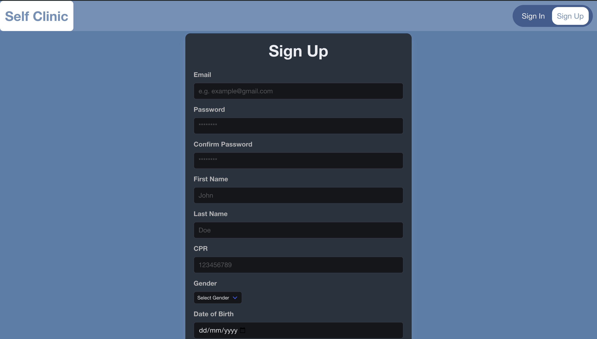
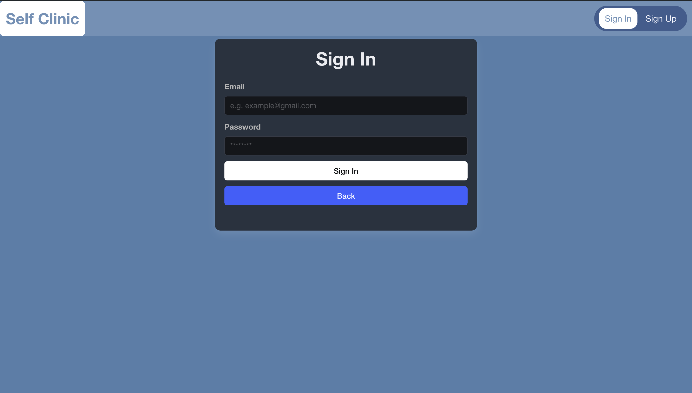
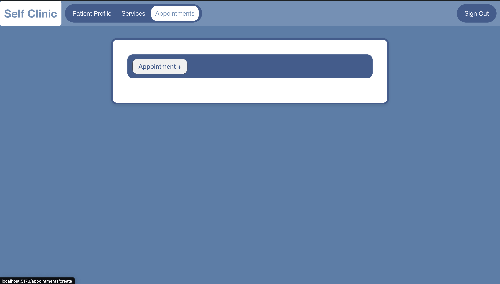
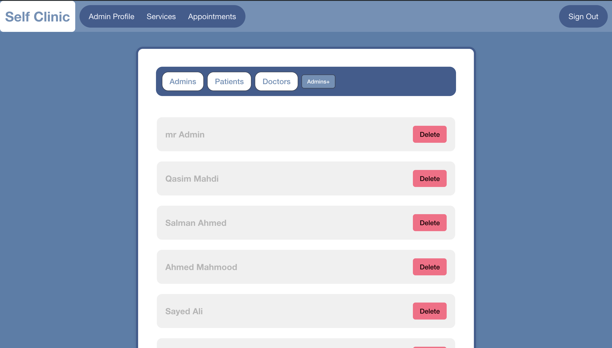
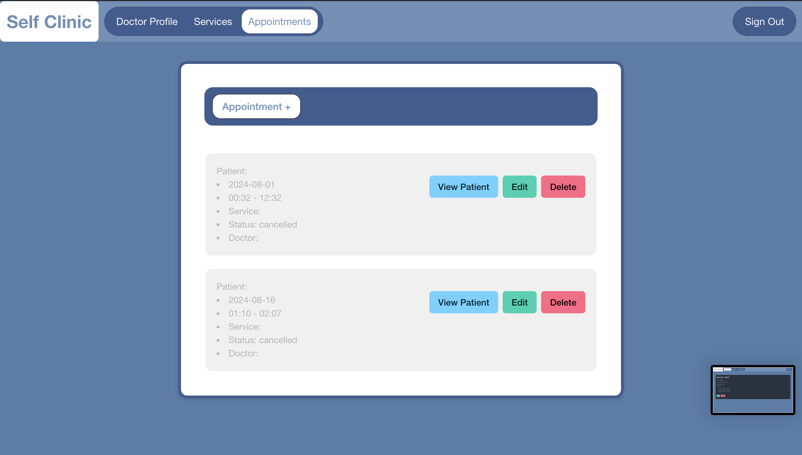

# **_Self-Clinic_**

## DATE:22-8-2024

## [Project Plan](https://trello.com/b/wL4ueIqi/cookie-monster) | [GitHub](https://github.com/nohaiz/self-clinic-back-end) | [Website](https://self-clinic-front-pqaddocse-nohaizs-projects.vercel.app/)

### Cookie Monster

1. Nohaiz Kaiser
2. Maryam Ali
3. Qasim Alhamad

## Description

**Self-Clinic** A web-based dental appointment system that allows patients to self-book appointments, streamlining scheduling and reducing administrative workload for the practice.

## Technologies Used

### Frontend:

- React: Library for building user interfaces with a component-based approach.
- React Router: Handles routing and navigation between pages in a React app.
- Navigate: Method for programmatically navigating routes in React Router
- Fetch API: Built-in method for making HTTP requests to interact with backend services.

### BACKEND:

### Frameworks:

- Express.js

### Libraries:

- Mongoose: For MongoDB interactions
- Bcrypt: For password hashing
- Dotenv: For environment variables
- JWT: For Autherization and Authentiction
- Morgan: For request logging

### Development Tools

- Nodemon For restarting whenever there is a change
- Postman For testing api by sending HTTP requests and viewing responds
- React Inspector Tool For debugging react applications

## How It Works

1. **Sign Up**: Click on the Sign Up button to register as a new Patient by completing the registration form.

2. **Sign In**: Use the Sign In button to log in with your credentials. Depending on your role, you can sign in as a Patient, Admin, or Doctor. 

   - **As a Patient**: You can book appointments and update your personal details.
   - **As an Admin**: You can view all admins, patients, and doctors, create new doctors and admins, and have the option to delete doctors, patients, and admins.
   - **As a Doctor**: You can view and manage your own appointments, update your availability, and modify your personal details.

## Future Updates

- [ ] Adding CRM for notification.
- [ ] Adding more validation
- [] Making a better css

## Useful links

- [Markdown Cheat-Sheet](https://www.markdownguide.org/cheat-sheet/)
- [CSS Design (BULMA)](https://bulma.io/)
- [Stack-OverFlow](https://stackoverflow.com/)
